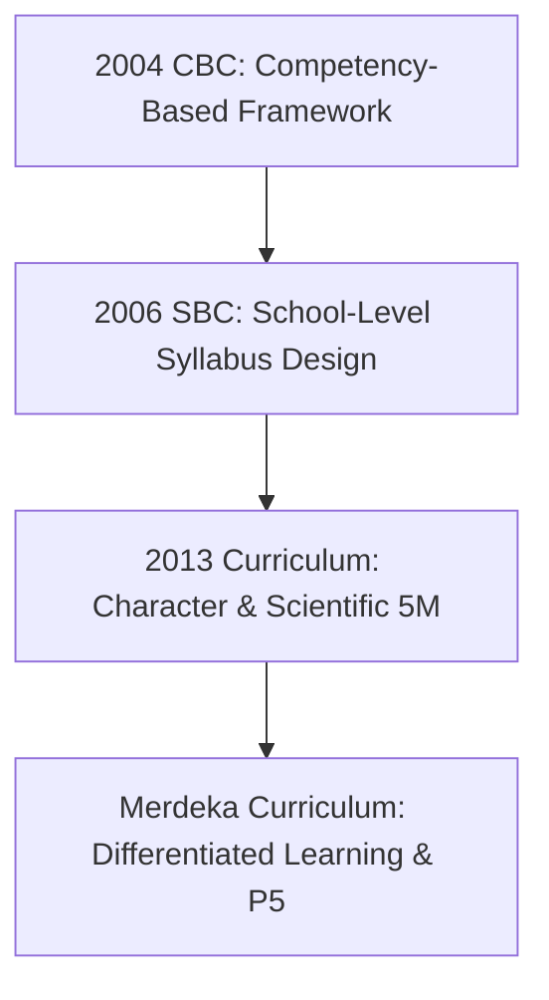

## The Reality Behind "New Minister, New Curriculum"

"Change the minister, change the curriculum." For decades, this phrase has been a recurring inside joke in staff rooms across Indonesian schools.

Whenever leadership shifts at the Ministry of Education, teachers brace themselves for new administrative templates, rebranded pedagogical jargon, and crash training workshops that often leave classrooms more bewildered than empowered.

Yet dismissing these frequent curriculum changes as mere political theater overlooks a vital historical pattern. Since declaring independence in 1945, Indonesia has revised its national curriculum at least 11 times. Each iteration directly reflects major geopolitical transitions, changing state ideologies, and mounting global economic pressures.

::note
Indonesia's curriculum history broadly falls into three defining eras: the **Post-Independence Era (1947–1968)** focused on decolonizing national identity, the **New Order Era (1975–1994)** built on central planning and industrial efficiency, and the **Reform Era to Present (2004–Present)** emphasizing school-level autonomy and competency-based flexibility.
::

---

## 1. The Post-Independence Foundation Era (1947–1968)

In the immediate aftermath of colonialism, academic prowess took a back seat. The state's primary mission was deconstructing colonial obedience and forging sovereign citizenship.

### The 1947 Lesson Plan (*Rentjana Pelajaran 1947*)

Formalized nationwide in 1950, this initial framework set the baseline:

- Dismantled the segregated Dutch colonial education structure.
- Prioritized civic character building, patriotism, and national sovereignty over raw academic rigor.
- Linked daily classroom lessons directly to real community survival challenges.

### The 1952 Unraveled Lesson Plan (*Rentjana Pelajaran Terurai 1952*)

This iteration introduced discrete subject matter syllabi. Teachers were assigned specific disciplines, and lesson content was tightly anchored to practical everyday vocational needs.

### The 1964 Education Plan (*Rentjana Pendidikan 1964*)

Toward the end of the Old Order, the government structured learning around the **Pancawardhana** framework: five distinct developmental pillars:

1. Moral development
2. Intellectual development
3. Emotional/artistic development
4. Manual and practical trade skills
5. Physical fitness

### The 1968 Curriculum

The rise of the New Order regime prompted a clean ideological break from previous left-leaning policies. The curriculum shifted toward reinforcing state ideology (Pancasila), religious moral training, and foundational knowledge tailored for national development programs.

---

## 2. Centralized Efficiency in the New Order Era (1975–1994)

Rapid industrialization and political centralization demanded rigid standardized instructional design across all provinces.

### The 1975 Curriculum: Objectives-Driven Instruction

Influenced by American Management by Objectives (MBO) frameworks, this curriculum introduced PPSI (Instructional System Development Procedures).

Teachers were mandated to write micro-level lesson units (*satuan pelajaran*) before every single session. The unintended consequence? Massive administrative burnout that diverted teacher focus away from interactive teaching.

### The 1984 Curriculum: Active Learning & The "Copy the Book" Irony

Indonesia introduced **Active Student Learning** (*Cara Belajar Siswa Aktif* / CBSA). Students were intended to observe, debate, and problem-solve in collaborative groups.

The conceptual model was forward-thinking. However, without adequate teacher coaching, many classrooms degenerated into students endlessly transcribing textbook passages, prompting the cynical pun *"Catat Buku Sampai Abis"* (Copy the Book Until It Ends).

### The 1994 Curriculum & 1999 Supplement

The academic calendar shifted from two semesters to three four-month trimesters (*caturwulan*). This era faced severe backlash due to severe content bloat; students were inundated with extensive national and local curricula without sufficient time for comprehension.

---

## 3. The Shift to Competency and School Autonomy (2004–2013)

The post-1998 democratic Reformasi movement decentralized educational authority.

### The 2004 Competency-Based Curriculum (CBC / KBK)

Moved the goalpost from textbook completion to measurable skill mastery. Schools were granted latitude to evaluate students through authentic performance tasks and portfolio assessments.

### The 2006 School-Based Curriculum (SBC / KTSP)

The central ministry established broad content benchmarks (Standar Isi) and graduate competencies (SKL), delegating full syllabus and lesson planning responsibilities to individual schools.

The downside: Educational disparity widened dramatically because teacher training and syllabus-design capacity varied drastically across urban and remote rural regions.

### The 2013 Curriculum (K-13)

Designed to counteract perceived moral decline and introduce Higher-Order Thinking Skills (*HOTS*).

- Deployed a standardized **5M Scientific Approach**: Observing, Questioning, Gathering Information, Associating, and Communicating.
- Introduced integrated thematic learning for elementary schools.
- **Friction point**: An extraordinarily convoluted authentic assessment matrix spanning 4 Core Competencies, requiring thousands of individual grading data points per semester.

---

## 4. Modern Paradigm: The Merdeka Curriculum (2022–Present)

The learning disruptions caused by the COVID-19 pandemic accelerated the release of a lean emergency framework, which matured into the **Merdeka Curriculum**.

The framework slashed mandatory content volume by 30–40%, relieving educators from racing through textbook chapters.

::steps
### Diagnostic Assessment

Teachers evaluate foundational skill baselines prior to launching any instructional unit.

### Differentiated Instruction

Pacing, reading materials, and assessment modalities are customized to match varied readiness levels inside the same classroom.

### Pancasila Student Profile Projects (P5)

Dedicated 20–30% of total curriculum hours to interdisciplinary, inquiry-driven projects solving tangible local community problems.
::

---

## Comparative Matrix: Core Curriculum Shifts Across Eras

| Curriculum Phase | Official Framework     | Core Paradigm                      | Primary Educator Challenge                       |
| :--------------- | :--------------------- | :--------------------------------- | :----------------------------------------------- |
| **1947**         | 1947 Lesson Plan       | Decolonization & Civic Character   | Severe scarcity of textbooks and teaching aids   |
| **1975**         | 1975 Curriculum        | Objectives-Driven (PPSI)           | Burdensome mandatory micro-lesson drafting       |
| **1984**         | 1984 Curriculum        | Active Student Learning (CBSA)     | Unprepared pedagogical facilitation skills       |
| **1994**         | 1994 Curriculum        | Heavy Content / Trimester System   | Chronic cognitive overload and long school hours |
| **2006**         | 2006 SBC (KTSP)        | School-Level Syllabus Autonomy     | Wide regional disparities in syllabus quality    |
| **2013**         | 2013 Curriculum (K-13) | Scientific Approach & Character    | Hyper-complex multi-rubric assessment reporting  |
| **2024**         | Merdeka Curriculum     | Differentiated & Phase-Based Goals | Demands high teacher diagnostic maturity         |

::tip
Do not get paralyzed by shifting bureaucratic acronyms. Regardless of the official curriculum title, actual learning quality depends entirely on how educators craft dialogue, scaffold productive struggle, and create safe spaces for student inquiry.
::

::conclusion
Analyzing curriculum history offers actionable clarity for educators and leaders alike:

- **For Teachers**: Leverage the flexibility of the Merdeka Curriculum to anchor instruction around foundational concepts without guilt over unread textbook pages.
- **For Policy Makers**: Structural curriculum reform collapses into ritual compliance unless professional development moves beyond administrative checklists to cultivate reflective classroom practice.
::

::faq
  :::faq-item
  ---
  question: Why has Indonesia updated its national curriculum so frequently?
  ---
  Curriculum shifts have historically tracked major political regime changes, transitions in national economic strategy, and urgent policy responses to low international reading and numeracy metrics (such as PISA rankings).
  :::

  :::faq-item
  ---
  question: What is the key functional difference between K-13 and the Merdeka Curriculum?
  ---
  K-13 enforced rigid annual Basic Competencies (KD) paired with extensive rubric reporting, whereas the Merdeka Curriculum organizes Learning Outcomes (CP) across multi-year developmental phases (2–3 years per phase), granting teachers leeway to adjust pacing to actual student readiness.
  :::

  :::faq-item
  ---
  question: Does adopting a new curriculum automatically boost educational outcomes?
  ---
  No. A written curriculum is merely an architectural blueprint. Real transformation relies on teacher pedagogical competence, equitable access to physical and digital resources, and consistent classroom-level instructional quality.
  :::
::
