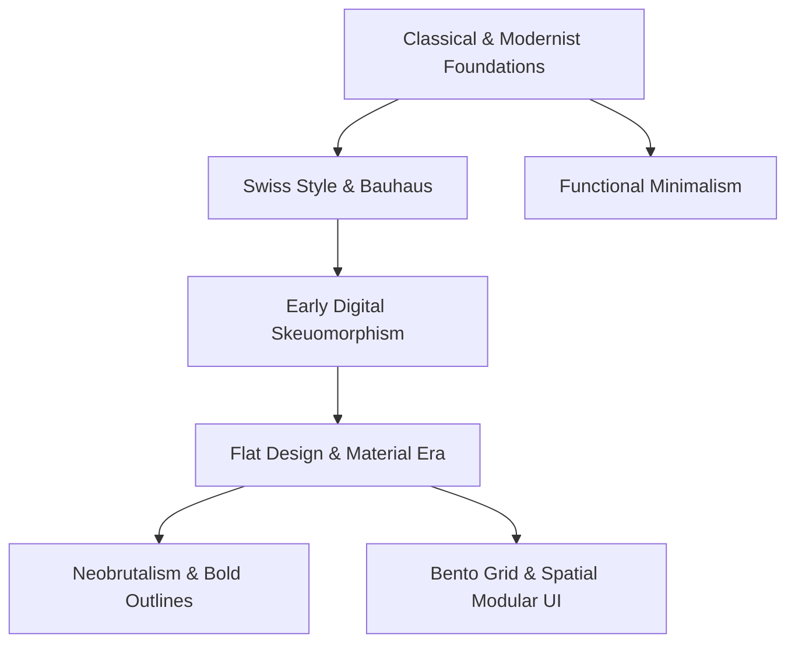

Most digital products and UI/UX design workflows stumble visually not because creators lack design assets, but because visual styles get mixed without a coherent structural hierarchy.

You have likely seen landing pages attempting the strict objectivity of *Swiss Style*, only to inject thick retro *Neobrutalist* outlines mid-page, wrapped up with frosted *Glassmorphism* cards at the bottom. The outcome is visual noise that exhausts the user's attention.


Design style is never merely decorative paint. Every visual movement emerged as a direct response to a physical medium, technological constraints, and specific communication demands of its era.

## The Evolution of Visual Paradigms

Selecting an appropriate aesthetic framework begins with understanding the functional purpose behind each movement.



## 1. Swiss Style (International Typographic Style)

Developed in Switzerland during the 1950s, this movement prioritizes uncompromising readability, objective visual hierarchy, and mathematical grid alignment.

### Core Visual Principles:

- **Sans-Serif Primacy:** Relying on workhorse typefaces like Helvetica, Univers, or Akzidenz-Grotesk as primary layout anchors.
- **Asymmetrical Hierarchy:** Dramatic contrast in font sizes structured over precise multi-column grids.
- **Active Negative Space:** Purposeful white space left unoccupied to steer cognitive reading flow.

::note
Swiss Style remains the benchmark choice for corporate publications, technical developer documentation, and data-dense dashboards where immediate comprehension outweighs decorative flair.
::

---

## 2. Neobrutalism (High-Contrast Expressive UI)

Neobrutalism arrived as a deliberate reaction against sterile, hyper-polished flat interfaces that had made modern SaaS websites feel indistinguishable from one another.

### Distinguishing Traits:

- **Thick Dark Borders:** Bold, unforgiving strokes (`2px` to `4px` solid dark borders).
- **Hard Unblurred Drop Shadows:** Crisp geometric shadows with zero gaussian blur (`box-shadow: 4px 4px 0px #000`).
- **High-Saturation Colors:** Punchy yellows, electric mint, or vibrant lavenders balanced by heavyweight sans-serif headers.

### Practical Trade-Offs:

This aesthetic injects instant character for developer tooling, creative portfolios, and indie maker products. However, deploying it blindly on complex enterprise fintech software or multi-tab analytics apps often causes cognitive fatigue over extended workflows.

---

## 3. Bento Grid UI (Modular Spatial Compartments)

Pioneered by Apple hardware presentations and inspired by Japanese bento boxes, this pattern divides complex feature sets into self-contained modular cards with rounded corners.

```text
+--------------------------+-------------+
|                          |   Card B    |
|       Card A (Hero)      | (Stat/Icon) |
|                          +-------------+
|                          |   Card C    |
+--------------------------+-------------+
|          Card D          |   Card E    |
+--------------------------+-------------+
```

### Why Bento Layouts Dominate Modern Web Interfaces:

1. **Dynamic Content Hierarchy:** Flagship features occupy broad span cards, while secondary stats fit naturally into compact square tiles.
2. **Effortless Responsiveness:** Modular cells reflow smoothly from wide desktop matrices into stacked single-column mobile cards.
3. **Instant Scannability:** Enables prospective users to digest 6–8 distinct feature highlights within seconds.

::tip
Leverage Bento Grids on product feature showcases, developer portfolios, and tiered subscription comparisons.
::

---

## 4. Glassmorphism & Subtle Soft Depth

Builds atmospheric depth using semi-transparent frosted panels (`backdrop-filter: blur()`), delicate luminescent borders, and layered floating surfaces.

::warning
Always monitor contrast ratios against accessibility standards (WCAG AAA). Delicate light text resting on dynamic frosted glass backgrounds frequently fails legibility on low-brightness mobile screens.
::

---

## Style Comparison Matrix

| Design Style      | Primary Strength                          | Known Limitation / Friction           | Optimal Use Case                               |
| :---------------- | :---------------------------------------- | :------------------------------------ | :--------------------------------------------- |
| **Swiss Style**   | Absolute clarity, timeless, authoritative | Feels rigid when hierarchy is weak    | Technical docs, data dashboards, corporate     |
| **Neobrutalism**  | Punchy identity, memorable, playful       | Visually demanding over long sessions | Dev tools, creative studios, indie software    |
| **Bento Grid**    | Modular flexibility, organized density    | Demands varied content formats        | Portfolio showcases, feature overviews         |
| **Glassmorphism** | Futuristic, premium, sensory depth        | Contrast issues and GPU overhead      | Floating overlays, control widgets, audio apps |

---

## Strategic Selection Framework

::steps
### Define Intent & Audience Expectations

Identify whether users prioritize transactional efficiency (lean toward Swiss/Minimalist) or emotional engagement (explore Bento/Neobrutalism).

### Audit Accessibility & Contrast

Verify that body text guarantees at least a 4.5:1 contrast ratio against card backgrounds before introducing blur or gradient treatments.

### Enforce Global Design Tokens

Establish consistent border-radii, stroke widths, and palette variables across your design system to avoid accidental visual collisions.
::

---

## Decision Framework

::conclusion
Every digital interface demands visual styling aligned directly with its functional purpose:

- **Choose Swiss Style / Bento Grid**: When building utilities, documentation hubs, or modular design portfolios that require maximum clarity.
- **Choose Neobrutalism**: When launching products in competitive spaces where standing out visually drives early conversion.
- **Avoid Indiscriminate Blending**: Do not pair chunky brutalist borders with frosted glass cards inside the same viewing viewport.
::

---


::faq
  :::faq-item
  ---
  question: Is Neobrutalism appropriate for enterprise SaaS applications?
  ---
  Generally no. While neobrutalist accents can energize marketing pages, deep data workflows and enterprise financial software require calm visual environments to prevent user fatigue.
  :::

  :::faq-item{question="What sets Bento Grid apart from traditional card grids?"}
  Traditional card grids typically repeat identical rectangular dimensions across rows. In contrast, Bento Grids intentionally vary column and row spans to construct an asymmetrical hierarchy that guides visual attention.
  :::

  :::faq-item
  ---
  question: How can developers prevent performance lag when using Glassmorphism
    blur effects?
  ---
  Apply `backdrop-filter: blur()` sparingly on static fixed overlays rather than repeatedly inside frequently scrolling table rows, and provide solid background fallbacks for devices with hardware acceleration constraints.
  :::
::
