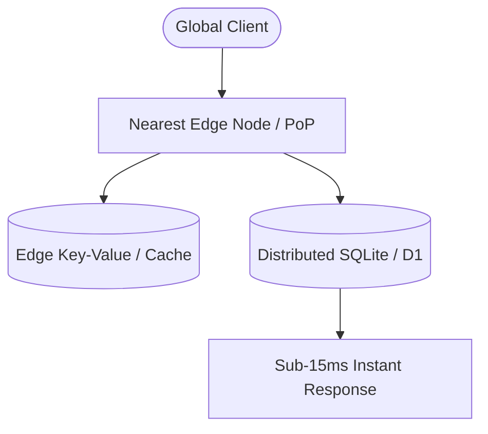

## The Ground Reality: Over-Provisioned and Sluggish Servers

Most production backend systems struggle not from a lack of raw hardware capacity, but from geographic latency penalties and the relentless financial drain of idle cloud infrastructure.

For years, software teams have routinely deployed multi-gigabyte virtual machines merely to serve basic Express.js microservices that sit idle 90% of the day.

The end result? Escalating monthly bills and sluggish response times for users outside the primary data center region.

## The Paradigm Shift: Moving Computation to the Physical Edge

Conventional hosting architectures force a user in Tokyo to route requests across the Pacific to a single server in Virginia just to fetch basic account preferences. In the modern edge computing paradigm, backend execution is decentralized across hundreds of Points of Presence (PoPs) worldwide.

### 1. V8 Isolates vs Heavyweight Docker Containers

First-generation serverless platforms suffered notorious multi-second *cold starts* because of container spin-up overhead.

Modern backend architectures replace container virtualization with lightweight **V8 Isolates** (pioneered by Cloudflare Workers, Deno Deploy, and the Nitro Engine). Bootstrapping overhead is virtually eliminated, dropping startup times to under **5 milliseconds**.

### 2. The Distributed SQLite Renaissance

For decades, monolithic PostgreSQL and MySQL instances were the default. Yet sending transactional queries over oceans incurs a 200–400ms round-trip penalty per API call.

The current industry breakthrough centers on **Distributed Embedded SQL** (such as Cloudflare D1, Turso/libSQL, and LiteFS). Lightweight SQLite databases run right next to the compute runtime, backed by asynchronous global replication.

::tip
Do not blindly migrate write-intensive transactional cores to Edge SQLite. Distributed SQLite excels at read-heavy workloads (95%+ reads), but single-writer constraints will bottleneck high-frequency financial write pipelines.
::

## Architectural Breakdown: Traditional Monolith vs Modern Edge Stack

Here is an objective engineering comparison between traditional server stacks and modern edge deployments:

| Parameter              | Monolith VPS / Docker Container         | Modern Edge Serverless Stack                 |
| :--------------------- | :-------------------------------------- | :------------------------------------------- |
| **Cold Start Latency** | 5 – 30 seconds (Container boot)         | 0 – 5 milliseconds (V8 Isolate)              |
| **Idle Running Cost**  | 100% hourly cost regardless of traffic  | $0.00 (Pure pay-per-request)                 |
| **Execution Topology** | Single Data Center Region               | 300+ Interconnected Global Cities            |
| **Data Layer**         | Centralized Relational DB               | Distributed SQLite / Global KV               |
| **Scaling Dynamics**   | Manual load balancers & Pod autoscalers | Instant autonomous scaling from 0 to 1M+ RPM |

::steps
### Profile Your Read/Write Ratio

Analyze database query logs. If your platform exhibits an 85%+ read-to-write skew, an Edge-first architecture will deliver immediate performance dividends.

### Decouple the Edge Gateway Layer

Deploy edge functions as an ultra-low-latency entry layer handling JWT validation, rate limiting, and response caching before forwarding heavy jobs to core services.

### Build on Universal Runtime Standards

Leverage modern vendor-agnostic engines like Nitro / H3 to ensure your backend logic builds seamlessly for Cloudflare, Node.js, Bun, or Vercel without vendor lock-in.
::

::conclusion
Architectural decisions must be guided by real operational trade-offs, not mere industry hype:

- **Adopt the Edge Serverless Stack**: When designing public developer APIs, global content platforms, latency-sensitive web apps, or SaaS products targeting sub-50ms international response times.
- **Retain the Traditional Monolith Stack (Node.js/Go/PostgreSQL)**: When managing heavy write-intensive ACID transaction pipelines (such as core banking exchanges) or long-running computational background tasks exceeding isolate execution time limits.
::

::faq
  :::faq-item
  ---
  question: Does Edge Serverless support all standard Node.js NPM packages?
  ---
  Not out-of-the-box. Edge runtimes adhere to standard Web APIs without full POSIX operating system layers. Packages relying on native C++ bindings or legacy raw TCP sockets require polyfills or driver adapters.
  :::

  :::faq-item
  ---
  question: How do edge workers safely connect to centralized legacy databases?
  ---
  Utilize connection pooling proxies (such as Hyperdrive, Prisma Accelerate, or serverless PostgreSQL drivers) to prevent connection exhaustion when thousands of distributed isolate instances execute simultaneously.
  :::

  :::faq-item
  ---
  question: Is Edge Serverless always cheaper than fixed virtual servers?
  ---
  For intermittent or bursty traffic patterns, Edge eliminates idle waste completely. However, for predictable 24/7 compute loads operating at consistent 90% CPU utilization, reserved virtual instances remain more economical per compute cycle.
  :::
::
