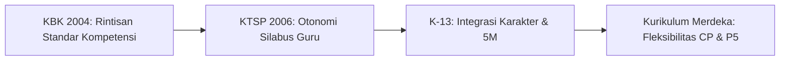

## Realitas di Balik Pameo "Ganti Menteri, Ganti Kurikulum"

"Ganti menteri, ganti kurikulum." Sindiran ini sudah puluhan tahun menjadi lelucon pahit di ruang-ruang guru seluruh Indonesia.

Setiap kali tampuk kepemimpinan kementerian berganti, para pendidik bersiap menghadapi tumpukan format administrasi baru, istilah silabus yang dirombak, dan pelatihan kilat yang sering kali menyisakan kebingungan di ruang kelas.

Namun, menyederhanakan pergantian kurikulum sekadar sebagai proyek politik birokrasi adalah kesimpulan yang keliru. Sejak proklamasi kemerdekaan tahun 1945, kurikulum nasional telah berganti setidaknya 11 kali. Setiap perubahan merupakan cermin dari pergolakan zaman, transisi rezim kekuasaan, dan upaya merespons tantangan ekonomi global.

::note
Perubahan kurikulum pada dasarnya terbagi dalam tiga era besar: **Era Pascakemerdekaan (1947–1968)** yang berfokus pada dekolonisasi watak, **Era Orde Baru (1975–1994)** yang mengutamakan efisiensi dan stabilitas nasional, serta **Era Reformasi hingga Sekarang (2004–sekarang)** yang mengarah pada otonomi sekolah dan fleksibilitas kompetensi.
::

---

## 1. Era Fondasi Pascakemerdekaan (1947–1968)

Pada masa awal kemerdekaan, pemerintah tidak memprioritaskan kecerdasan akademis murni. Fokus utamanya adalah membongkar mentalitas kolonial warisan Belanda dan Jepang.

### Rentjana Pelajaran 1947

Kurikulum pertama Republik Indonesia ini baru resmi berjalan pada 1950. Ciri utamanya:

- Menggantikan sistem pendidikan kolonial Belanda yang diskriminatif.
- Mengutamakan pendidikan watak, kesadaran bernegara, dan kedaulatan bangsa.
- Materi pelajaran dihubungkan langsung dengan peristiwa keseharian masyarakat.

### Rentjana Pelajaran Terurai 1952

Penyempurnaan dari kurikulum 1947. Di sini, silabus mata pelajaran mulai dirinci secara eksplisit. Setiap guru hanya mengajar satu mata pelajaran tertentu, dan materi dikaitkan erat dengan kebutuhan hidup sehari-hari.

### Rentjana Pendidikan 1964

Menjelang akhir era Orde Lama, pemerintah memperkenalkan sistem **Pancawardhana**, yaitu pembinaan lima kelompok bidang studi:

1. Perkembangan moral
2. Perkembangan kecerdasan
3. Perkembangan emosional/artistik
4. Perkembangan keprigelan (keterampilan tangan)
5. Perkembangan jasmani

### Kurikulum 1968

Kelahiran Orde Baru membawa pembersihan ideologi terhadap kurikulum sebelumnya. Fokus pendidikan diarahkan untuk membentuk manusia Pancasila sejati, mempertebal moral keagamaan, dan memperkuat fisik demi mendukung pembangunan nasional.

---

## 2. Era Sentralisasi & Efisiensi Orde Baru (1975–1994)

Stabilitas politik dan pertumbuhan ekonomi Orde Baru menuntut standarisasi pendidikan yang sangat ketat dari pusat.

### Kurikulum 1975: Masuknya Manajemen Berbasis Tujuan

Kurikulum ini dipengaruhi oleh konsep MBO (*Management by Objectives*). Segala kegiatan belajar disusun menggunakan sistem PPSI (Prosedur Pengembangan Sistem Instruksional).

Guru diwajibkan menulis satuan pelajaran (satpel) yang sangat rinci untuk setiap pertemuan. Dampaknya? Guru kehabisan energi di meja kerja hanya untuk urusan administratif.

### Kurikulum 1984: CBSA dan Ironi "Catat Buku Sampai Abis"

Pemerintah memperkenalkan model **Cara Belajar Siswa Aktif (CBSA)** atau *Student Active Learning*. Siswa diposisikan sebagai subjek yang mengamati, mengelompokkan, dan mendiskusikan materi.

Di atas kertas konsep ini revolusioner. Tapi di lapangan, banyak guru yang belum siap memfasilitasi diskusi dan akhirnya membiarkan siswa menyalin buku pelajaran berlembar-lembar—hingga melahirkan plesetan *"Catat Buku Sampai Abis"*.

### Kurikulum 1994 & Suplemen 1999

Sistem pembagian waktu belajar beralih dari semester ke caturwulan (tiga kali evaluasi setahun). Kurikulum ini menuai banyak kritik tajam karena beban materi yang terlampau padat. Siswa dijejali materi muatan nasional dan lokal sekaligus tanpa ruang eksplorasi mendalam.

---

## 3. Era Otonomi & Standar Kompetensi (2004–2013)

Gelombang Reformasi mengubah arah pendidikan dari sentralistik menjadi desentralistik.

### KBK 2004 (Kurikulum Berbasis Kompetensi)

Menitikberatkan pada pencapaian kompetensi siswa, bukan sekadar ketuntasan materi buku. Sekolah diberikan kebebasan mengembangkan instrumen penilaian berbasis hasil karya dan portofolio.

### KTSP 2006 (Kurikulum Tingkat Satuan Pendidikan)

Pemerintah pusat hanya menetapkan Standar Isi (SI) dan Standar Kompetensi Lulusan (SKL). Kerangka silabus dan RPP diserahkan sepenuhnya kepada masing-masing sekolah dan guru.

Kelemahannya: Kesenjangan mutu antarsekolah melebar karena kapasitas guru dalam merancang kurikulum mandiri belum merata.

### Kurikulum 2013 (K-13)

K-13 lahir untuk menjawab penurunan karakter generasi muda dan integrasi kemampuan berpikir tingkat tinggi (*HOTS*).

- Memakai **Pendekatan Saintifik (5M)**: Mengamati, Menanya, Mengumpulkan informasi, Mengasosiasi, dan Mengomunikasikan.
- Pembelajaran tematik terpadu di tingkat sekolah dasar.
- **Titik lemah**: Format penilaian autentik yang terlalu rumit dengan matriks 4 Kompetensi Inti (Spiritual, Sosial, Pengetahuan, Keterampilan) yang membebani ribuan butir nilai per siswa.

---

## 4. Transformasi Mutakhir: Kurikulum Merdeka (2022–Sekarang)

Pandemi COVID-19 mempercepat lahirnya kurikulum darurat yang kemudian disempurnakan menjadi **Kurikulum Merdeka**.

Kurikulum ini memangkas materi esensial hingga 30–40% agar pembelajaran tidak lagi terburu-buru mengejar target materi buku teks.

::steps
### Asesmen Diagnostik Awal

Guru memetakan kemampuan dasar siswa sebelum memulai bab baru.

### Pembelajaran Berdiferensiasi

Materi dan metode disesuaikan dengan tingkat kesiapan (*readiness*) serta gaya belajar peserta didik di satu ruang kelas yang sama.

### Projek Penguatan Profil Pelajar Pancasila (P5)

Alokasi waktu khusus 20–30% untuk proyek kokurikuler lintas disiplin ilmu yang fokus pada isu riil di lingkungan sekitar.
::

---

## Tabel Komparasi: Perubahan Fokus Kurikulum Lintas Era

| Periode Kurikulum | Nama Resmi              | Pendekatan Utama                   | Beban & Tantangan Guru                     |
| :---------------- | :---------------------- | :--------------------------------- | :----------------------------------------- |
| **1947**          | Rentjana Pelajaran 1947 | Pembentukan karakter kebangsaan    | Minim fasilitas dan buku panduan           |
| **1975**          | Kurikulum 1975          | Instruksional terstruktur (PPSI)   | Beban penulisan Satuan Pelajaran (Satpel)  |
| **1984**          | Kurikulum 1984          | CBSA (Cara Belajar Siswa Aktif)    | Kesiapan pedagogi guru memandu diskusi     |
| **1994**          | Kurikulum 1994          | Padat konten / Sistem Caturwulan   | Materi overload & jam belajar panjang      |
| **2006**          | KTSP                    | Otonomi silabus di level sekolah   | Ketimpangan mutu pembuatan silabus lokal   |
| **2013**          | Kurikulum 2013 (K-13)   | Pendekatan Saintifik & Karakter    | Rubrik matriks penilaian autentik berbelit |
| **2024**          | Kurikulum Merdeka       | Berdiferensiasi & Fleksibilitas CP | Menuntut kepekaan guru mendiagnosis siswa  |

::tip
Jangan terjebak pada format administrasi dokumen. Apapun nama kurikulumnya, kualitas pembelajaran di ruang kelas selalu ditentukan oleh cara guru membangun interaksi, mengajukan pertanyaan pemantik, dan memberi ruang siswa untuk mencoba dan gagal.
::

::conclusion
Memahami sejarah kurikulum memberikan perspektif berharga bagi para pendidik:

- **Bagi Guru**: Gunakan fleksibilitas Kurikulum Merdeka saat ini untuk fokus pada materi esensial tanpa rasa bersalah jika belum menuntaskan seluruh halaman buku teks.
- **Bagi Pengambil Kebijakan**: Kurikulum baru tidak akan pernah berhasil jika intervensi pelatihan hanya menyentuh format administrasi tanpa menyentuh paradigma berpikir guru di kelas.
::

::faq
  :::faq-item{question="Mengapa kurikulum di Indonesia sangat sering berubah?"}
  Perubahan kurikulum didorong oleh tiga hal utama: penyesuaian terhadap arah politik pemerintahan baru, respons terhadap perkembangan teknologi industri, serta hasil evaluasi ketertinggalan literasi dan numerasi siswa di tingkat internasional (seperti skor PISA).
  :::

  :::faq-item
  ---
  question: Apa perbedaan paling mendasar antara K-13 dan Kurikulum Merdeka?
  ---
  K-13 mematok Kompetensi Dasar (KD) kaku per jenjang kelas dengan penilaian rubrik yang sangat detail, sedangkan Kurikulum Merdeka menggunakan Capaian Pembelajaran (CP) berbasis fase (2–3 tahun per fase) sehingga guru leluasa menyesuaikan kecepatan belajar dengan kondisi siswa.
  :::

  :::faq-item
  ---
  question: Apakah ganti kurikulum selalu menjamin peningkatan mutu siswa?
  ---
  Tidak. Dokumen kurikulum hanyalah cetak biru (*blueprint*). Kunci utama peningkatan mutu tetap berada pada kompetensi guru, ketersediaan fasilitas pendukung yang merata, dan konsistensi evaluasi proses pembelajaran di lapangan.
  :::
::
