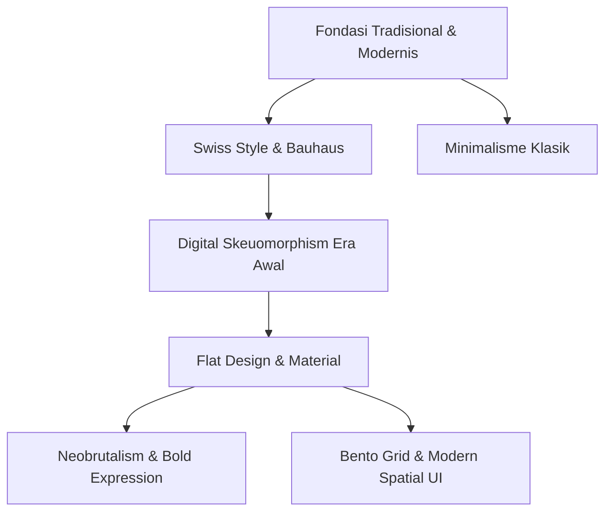

Banyak proyek digital dan produk desain UI/UX berakhir berantakan bukan karena desainer kekurangan stok aset visual, melainkan karena percampuran gaya tanpa fondasi hierarki yang jelas.

Kita sering melihat sebuah landing page yang ingin tampak formal seperti *Swiss Style*, tapi mendadak diselipkan ornamen *Neobrutalism* bergaris hitam tebal, lalu ditutup dengan kartu *Glassmorphism* transparan yang buram. Hasilnya? Visual yang membingungkan dan melelahkan mata pengguna.


Gaya desain bukan sekadar kosmetik pemanis tampilan. Setiap gaya lahir dari respons terhadap medium, keterbatasan teknologi, dan kebutuhan komunikasi pada zamannya.

## Anatomi Evolusi Gaya Desain

Memilih gaya visual yang tepat memerlukan pemahaman tentang asal-usul dan tujuan fungsional dari masing-masing estetika.



## 1. Swiss Style (International Typographic Style)

Lahir di Swiss pada dekade 1950-an, gaya ini berfokus pada keterbacaan mutlak (*readability*), objektivitas informasi, dan struktur berbasis kisi (*grid system*).

### Karakteristik Kunci:

- **Tipografi Sans-Serif:** Penggunaan font seperti Helvetica, Univers, atau Akzidenz-Grotesk sebagai pahlawan utama tata letak.
- **Hierarki Asimetris:** Teks berukuran kontras tinggi yang disusun pada grid matematis presisi.
- **Ruang Negatif Luas:** Bidang kosong yang sengaja dibiarkan untuk memandu alur pandang mata.

::note
Swiss Style adalah pilihan terbaik untuk website korporat, dokumentasi teknis, dan platform berita yang mengutamakan kecepatan pemindaian informasi tanpa distraksi visual berlebih.
::

---

## 2. Neobrutalism (Retro-Modern Raw UI)

Neobrutalisme adalah bentuk pemberontakan visual terhadap gaya minimalis datar (*flat design*) yang dianggap terlalu steril, seragam, dan membosankan.

### Ciri Khas Visual:

- **Border Hitam Tebal:** Garis tepi tegas (`2px` hingga `4px` solid black).
- **Hard Drop Shadows:** Bayangan kaku pekat tanpa blur (`box-shadow: 4px 4px 0px #000`).
- **Warna Kontras Tinggi:** Kombinasi kuning cerah, hijau neon, atau lavender dengan teks tebal.

### Kompromi di Lapangan:

Gaya ini sangat menarik perhatian dan terasa berani untuk audiens muda, kreator, serta startup teknologi. Namun, jika dipakai serampangan pada aplikasi perbankan atau SaaS data analytics, antarmuka akan terasa bising dan sulit dibaca dalam durasi kerja yang panjang.

---

## 3. Bento Grid UI (Apple-Style Modular Layout)

Terinspirasi dari kotak makan bento khas Jepang, gaya ini membagi ruang informasi ke dalam beberapa kompartemen kartu modular berukuran variatif dengan sudut melengkung (*rounded corners*).

```text
+--------------------------+-------------+
|                          |   Card B    |
|       Card A (Hero)      | (Stat/Icon) |
|                          +-------------+
|                          |   Card C    |
+--------------------------+-------------+
|          Card D          |   Card E    |
+--------------------------+-------------+
```

### Mengapa Bento Grid Sangat Populer?

1. **Hierarki Konten Dinamis:** Fitur unggulan mendapatkan kartu berukuran besar (*span 2*), sementara statistik kecil menempati kartu kompak.
2. **Kerapian Responsif:** Sangat fleksibel saat diatur ulang dari grid multi-kolom desktop menjadi tumpukan vertikal di layar ponsel.
3. **Scannability Tinggi:** Membantu pengguna memproses 5–8 poin fitur hanya dalam sekali lirik.

::tip
Gunakan Bento Grid terutama pada halaman portofolio, showcase produk teknologi, dan ringkasan fitur *pricing tier*.
::

---

## 4. Glassmorphism & Modern Soft Depth

Mengandalkan efek kaca semi-transparan dengan latar belakang buram (*background blur* / `backdrop-filter: blur()`), tepian tipis bercahaya, dan bayangan lembut bergradasi.

::warning
Hati-hati dengan rasio kontras warna (*WCAG AAA standard*). Teks tipis di atas latar belakang kaca buram yang dinamis sering kali tidak terbaca bagi pengguna dengan gangguan penglihatan atau layar dengan kecerahan rendah.
::

---

## Matriks Perbandingan Karakteristik Gaya

| Gaya Desain       | Kekuatan Utama                          | Titik Kelemahan / Batasan            | Konteks Penggunaan Terbaik                 |
| :---------------- | :-------------------------------------- | :----------------------------------- | :----------------------------------------- |
| **Swiss Style**   | Kejelasan informasi, abadi, profesional | Terkesan kaku jika salah hierarki    | Dashboard data, blog teknis, korporat      |
| **Neobrutalism**  | Ekspresif, berkarakter kuat, *playful*  | Melelahkan mata untuk konten panjang | Tools developer, landing page kreatif      |
| **Bento Grid**    | Tata letak rapi, visual modular modular | Butuh variasi konten yang presisi    | Portofolio, showcase produk, bento cards   |
| **Glassmorphism** | Mewah, futuristik, modern               | Masalah kontras & performa rendering | Kartu overlay, control panel, audio player |

---

## Langkah Menentukan Gaya Visual Proyek

::steps
### Tentukan Fungsi Utama & Audiens

Kenali apakah target pengguna membutuhkan efisiensi kerja cepat (pilih Swiss/Minimalis) atau pengalaman emosional yang berkesan (pilih Neobrutalism/Bento).

### Uji Aksesibilitas Kontras

Pastikan teks memiliki rasio kontras minimal 4.5:1 terhadap latar belakang kartu sebelum menerapkan efek gradasi atau transparansi.

### Terapkan Sistem Desain Konsisten

Tetapkan batas radius sudut (*border-radius*), ketebalan garis tepi, dan palet warna dalam variabel global agar tidak terjadi campur aduk gaya.
::

---

## Panduan Pengambilan Keputusan

::conclusion
Setiap proyek digital membutuhkan pendekatan estetika yang selaras dengan nilai komunikasinya:

- **Pilih Swiss Style / Bento Grid**: Jika produk Anda berfokus pada utilitas tinggi, kerapian informasi modular, dan portofolio profesional.
- **Pilih Neobrutalism**: Jika Anda membangun produk untuk komunitas kreatif, gaming, atau ingin tampil mencolok di tengah kompetisi yang seragam.
- **Hindari Pencampuran Gaya Ekstrem**: Jangan menggabungkan border tebal retro dengan kartu kaca semi-transparan dalam satu tampilan layar yang sama.
::

---

## Pertanyaan yang Sering Diajukan (FAQ)

::faq
  :::faq-item
  ---
  question: Apakah gaya Neobrutalisme cocok untuk semua jenis website?
  ---
  Tidak. Neobrutalisme sangat cocok untuk portofolio kreatif, landing page acara, atau brand yang ingin tampil unik. Gaya ini kurang tepat untuk aplikasi perbankan, portal hukum, atau e-commerce besar yang mengutamakan ketenangan dan kebiasaan mental model pengguna.
  :::

  :::faq-item
  ---
  question: Apa perbedaan utama antara Flat Design klasik dan Bento Grid?
  ---
  Flat Design klasik berfokus pada peniadaan kedalaman visual (tanpa bayangan atau tekstur), sedangkan Bento Grid adalah pola pengorganisasian tata letak (*layout framework*) yang membungkus konten dalam kartu-kartu modular dengan sudut membulat dan hierarki ukuran yang kontras.
  :::

  :::faq-item
  ---
  question: Bagaimana cara menjaga performa website saat menggunakan efek Glassmorphism?
  ---
  Gunakan properti CSS `backdrop-filter: blur()` secukupnya pada elemen overlay statis, hindari penggunaan blur berlebih pada elemen yang sering di-scroll, dan selalu sediakan fallback warna solid untuk browser yang belum mendukung rendering GPU secara optimal.
  :::
::
