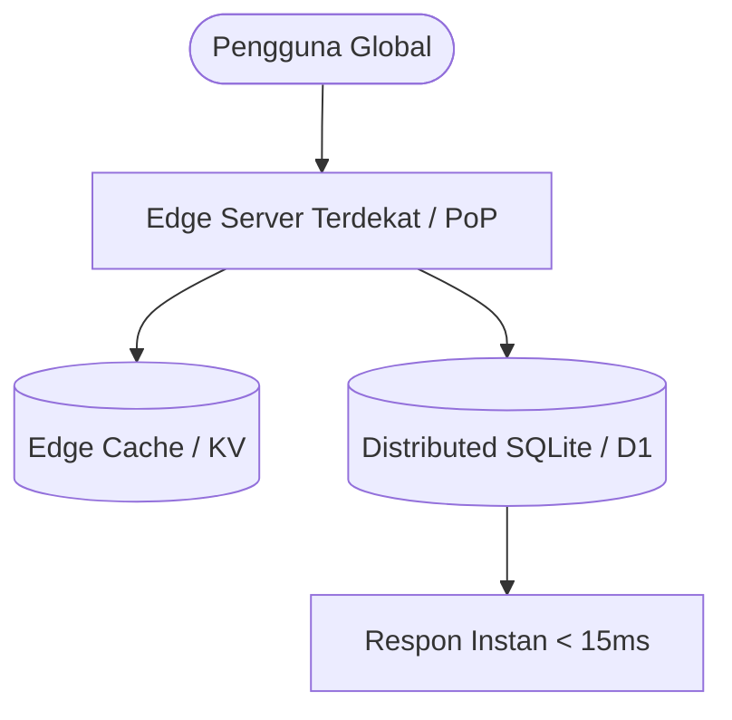

## Realitas Lapangan: Server Konvensional yang Terlalu Gemuk

Banyak arsitektur backend di dunia nyata runtuh bukan karena kehabisan RAM, melainkan karena latensi jaringan antarbenua yang lambat dan biaya operasional server menganggur (*idle instance*) yang membengkak tanpa henti.

Kita terbiasa menyewa VPS berukuran gigabyte hanya untuk menjalankan API Express.js sederhana yang 90% waktunya hanya menunggu request masuk.

Hasilnya? Pemborosan biaya dan latensi tinggi bagi pengguna di luar radius data center utama.

## Pergeseran Paradigma: Mengapa Komputasi Bergerak ke Tepi Jaringan (*The Edge*)

Model komputasi konvensional memaksa pengguna di Tokyo menghubungi server di Frankfurt hanya untuk membaca data profil. Di era komputasi tepi (*edge computing*), logika backend Anda tidak lagi menetap di satu server tunggal, melainkan didistribusikan ke ratusan *Point of Presence* (PoP) di seluruh dunia.

### 1. Eksekusi Berbasis V8 Isolate vs Kontainer Docker

Serverless generasi pertama (seperti AWS Lambda lama) sering dikritik karena masalah *cold start* yang memakan waktu hingga beberapa detik saat kontainer dinyalakan.

Teknologi backend modern mengganti kontainer Docker dengan **V8 Isolates** (seperti yang digunakan Cloudflare Workers, Deno Deploy, dan Nitro Engine). Waktu inisiasi kode dipangkas menjadi di bawah **5 milidetik**.

### 2. Kebangkitan SQLite di Skala Global

Selama puluhan tahun, PostgreSQL dan MySQL terpusat mendominasi industri. Tapi mengirim query SQL melintasi samudera memicu *latency penalty* hingga 200–400 milidetik per request.

Solusi terobosan saat ini adalah **Distributed Embedded SQL** (seperti Cloudflare D1, Turso/libSQL, dan LiteFS). Database SQLite ditempatkan sedekat mungkin dengan mesin eksekusi kode, dengan sinkronisasi replikasi asinkron di latar belakang.

::tip
Jangan terburu-buru memindahkan transaksi perbankan dengan konkurensi tulis (*write-heavy*) super tinggi ke Edge SQLite. SQLite di Edge luar biasa cepat untuk beban baca (*read-heavy 95%*), namun memiliki batasan konkurensi pada serialisasi *single-writer*.
::

## Perbandingan Arsitektur: Monolith Tradisional vs Edge Serverless

Berikut adalah perbandingan objektif antara pendekatan tradisional dan tumpukan backend modern:

| Parameter                      | Monolith VPS / Kontainer         | Modern Edge Serverless Stack           |
| :----------------------------- | :------------------------------- | :------------------------------------- |
| **Waktu Booting (Cold Start)** | 5 – 30 detik (Docker boot)       | 0 – 5 milidetik (V8 Isolate)           |
| **Biaya Saat Menganggur**      | Tetap bayar 100% per jam         | Rp 0 (Murni *Pay-per-request*)         |
| **Lokasi Eksekusi**            | 1 Data Center (e.g. Singapura)   | 300+ Kota di Seluruh Dunia             |
| **Model Database**             | Server RDBMS Terpusat            | Distributed SQLite / Global KV Store   |
| **Kompleksitas Scaling**       | Butuh Load Balancer & Kubernetes | Auto-scale instan dari 0 ke jutaan RPM |

::steps
### Evaluasi Karakteristik Beban Kerja

Periksa rasio baca vs tulis pada aplikasi Anda. Jika 85%+ request adalah pembacaan data, arsitektur Edge adalah kandidat ideal.

### Pisahkan Server Core dengan Edge Gateway

Gunakan Edge Serverless sebagai API Gateway berlatensi rendah untuk autentikasi token, caching respons, dan agregasi data mikro.

### Adopsi Framework Universal (Nitro / H3)

Gunakan engine backend modern yang independen terhadap vendor (*vendor-agnostic*), sehingga kode backend Anda dapat di-deploy ke Cloudflare, Node.js, Vercel, maupun Bun tanpa perubahan logika.
::

::conclusion
Keputusan memilih arsitektur backend harus berakar pada kebutuhan riil bisnis, bukan sekadar mengikuti tren:

- **Pilih Edge Serverless Stack**: Jika Anda membangun API publik, situs konten terdistribusi, SaaS global dengan pembacaan masif, atau antarmuka aplikasi dengan target latensi di bawah 50ms.
- **Tetap Gunakan Monolith Tradisional (Node.js/Go/Postgres)**: Jika sistem Anda memerlukan transaksi relasional ACID berskala ekstrem dengan ribuan penulisan per detik (*write-intensive financial systems*) atau pemrosesan komputasi CPU intensif jangka panjang.
::

::faq
  :::faq-item
  ---
  question: Apakah Edge Serverless mendukung semua paket NPM Node.js?
  ---
  Tidak seluruhnya. Edge runtime berjalan di atas standar Web API (V8 Isolates) tanpa subsistem OS penuh, sehingga modul yang bergantung pada *native C++ bindings* atau soket raw TCP lama memerlukan adaptasi atau polyfill Node.js compatibility.
  :::

  :::faq-item
  ---
  question: Bagaimana cara mengelola koneksi database terpusat dari Edge?
  ---
  Gunakan koneksi berbasis HTTP / WebSocket atau database proxy (seperti Hyperdrive, Prisma Accelerate, atau Neon Serverless) untuk mencegah kehabisan batas *connection pool* saat ribuan edge workers aktif bersamaan.
  :::

  :::faq-item
  ---
  question: Apakah arsitektur Edge lebih murah daripada VPS konvensional?
  ---
  Untuk aplikasi dengan trafik fluktuatif atau bertumbuh, Edge jauh lebih hemat karena biaya menganggur adalah nol. Namun untuk beban komputasi CPU statis 24/7 dengan utilisasi konstan 90%, VPS sewa bulanan tetap bisa lebih hemat per satuan komputasi.
  :::
::
